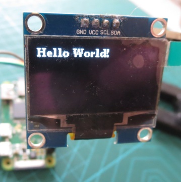
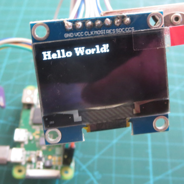
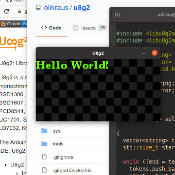

libu8g2arm
==========

The libu8g2arm package makes the
[U8g2: Library for monochrome displays](https://github.com/olikraus/u8g2)
available for building and installing on Linux-based OSs running
on the Raspberry Pi.

It includes source code from [U8g2](https://github.com/olikraus/u8g2)
and the [u8g2-arm-linux](https://github.com/wuhanstudio/u8g2-arm-linux)
port.

Support
-------

libu8g2arm is a new package, and likely to contain bugs.

The package is generated by a script, which makes several changes
to the base U8g2 code, and specifies how the code will be built.

Any bugs found when using libu8g2arm should first be considered to be
be specific to the libu8g2arm package, rather than being U8g2 bugs, and
reported to the libu8g2arm project. I will respond to every issue reported,
and review anything that relates to packaging. However, The help I can
provide for other kinds of issues will be limited (I am a casual U8g2 user
and only have a couple of screens for testing).

Examples
--------

See [Examples](examples/README.md).

 
 
 


Build and Install
-----------------

The package is built with the Autotools. Create the configure file
by running
```
./bootstrap
```
Then, build and install in the usual way.

**System-wide install**
```
   ./configure
   make
   sudo make install-strip
```
**Local install**
```
   ./configure --prefix="/home/myname/some/dir"
   make
   make install-strip
```
**Cross-compile**

Make a *arm-unknown-linux-gnueabi* toolchain with
[crosstool-NG](https://crosstool-ng.github.io/), then
```
   ./configure --host=arm-unknown-linux-gnueabi --prefix="/home/myname/some/dir"
   make
   make install-strip
```

Using the library
-----------------

A display can set up as detailed by the U8g2 project, with some minor
differences. A C++ method is also provided for specifying the display
at runtime.

### Using C and a fixed display

Example program [ex_init_c.c](examples/ex_init_c.c).

Include
```
#include <libu8g2arm/u8g2.h>
#include <libu8g2arm/u8g2arm.h>
```

Follow the instructions for 
[U8g2 C setup](https://github.com/olikraus/u8g2/wiki/u8g2setupc).

The gpio callback is `u8x8_arm_linux_gpio_and_delay` and may be used with the
following byte routines (not all tested)
* `u8x8_byte_arm_linux_hw_i2c`
* `u8x8_byte_sw_i2c`
* `u8x8_byte_arm_linux_hw_spi`
* `u8x8_byte_4wire_sw_spi`
* `u8x8_byte_3wire_sw_spi`
* `u8x8_byte_8bit_8080mode`

When using hardware I2C or SPI routines, ensure that the corresponding linux
device is enabled (e.g. `/boot/config.txt` contains `dtparam=i2c_arm=on` or
`dtparam=spi=on`). In the program, after calling the display setup function,
register the device parameters
* hardware I2C must call `u8g2arm_arm_init_hw_i2c(u8x8, bus_number)`
* hardware SPI must call `u8g2arm_arm_init_hw_spi(u8x8, bus_number, cs_number)`

### Using C++ and a fixed display

Example program [ex_init_class.cpp](examples/ex_init_class.cpp).

Include
```
#include <libu8g2arm/u8g2arm.h>
#include <libu8g2arm/U8g2lib.h>
```

Follow the instructions for 
[U8g2 C++ setup](https://github.com/olikraus/u8g2/wiki/u8g2setupcpp)

Only the setup classes ending in `_F` are included in the library.

When using hardware I2C or SPI routines, ensure that the corresponding linux
device is enabled (e.g. `/boot/config.txt` contains `dtparam=i2c_arm=on` or
`dtparam=spi=on`). In the program, after calling the display setup function,
register the device parameters
* hardware I2C must call `u8g2arm_arm_init_hw_i2c(u8x8, bus_number)`
* hardware SPI must call `u8g2arm_arm_init_hw_spi(u8x8, bus_number, cs_number)`

The U8g2 initialisation class constructors for hardware SPI include a
CS argument. This argument is unused (the passed value is ignored), but
has been retained for compatibility. The CS GPIO number is instead determined
by the choice of SPI bus and CS numbers.

### Using C++ and a display specified at runtime

Example program [ex_init_runtime.cpp](examples/ex_init_runtime.cpp).

Include
```
#include <libu8g2arm/U8g2Controller.h>
#include <libu8g2arm/U8g2lib.h>
```

The header [U8g2Controller.h](src/include/U8g2Controller.h) is fully
documented and contains all the controller and parameter settings.

### Linking and Fonts

To link to the U8g2arm library, which contains contains only permissive
license code and fonts, link to `libu8g2arm` (licence: COPYING_permissive).

To use GPL and other copyleft fonts, additionally include
`libu8g2arm/u8g2_fonts_gplcopyleft.h` and link to `libu8g2fonts_gplcopyleft`
(additional licence: COPYING_gplcopyleft), and note that this library is
covered by the GPL and not the LGPL. To use noncommercial fonts, additionally
include `libu8g2arm/u8g2_fonts_noncommercial.h` and link to
`libu8g2fonts_noncommercial` (additional licence: COPYING_noncommercial).

An extra font, `u8g2_font_unifont_world`, is included with the copyleft fonts
and includes unifont glyphs for many of the world's languages.

### Notes

The software I2C and SPI drivers may be unacceptably slow. I recommend
connecting the device to work with a /dev/i2c-X or /dev/spidevX.Y linux
device, and then use the hardware driver instead.

Package Regeneration
--------------------

The package includes all the components used to generate it, which can
be used to synchronise with the latest U8g2 code.

Regenerating the package is not required for normal use, and the
regeneration process may need to be updated to account for changes to U8g2.
For example, the regeneration script may fail, or some replacement files
in setup/files may need to be updated manually if the original files change.

**WARNING**: regenerating the package will delete the src directory before
recreating it, and any local changes made under the src directory will be lost.

To regenerate the package, clone
[U8g2](https://github.com/olikraus/u8g2)
into a directory parallel to the libug2arm directory, then run
[setup_src.sh](setup_src.sh)
from the libu8g2arm top level directory.

Contact
-------

[Adrian Rossiter](https://github.com/antiprism)

Credits
-------

The [U8g2: Library for monochrome displays](https://github.com/olikraus/u8g2)
is developed by [Olikraus](https://github.com/olikraus)

The [U8g2 Arm Linux Port](https://github.com/wuhanstudio/u8g2-arm-linux)
is developed by
*   Author: Wu Han
*   Homepage: http://wuhanstudio.cc
*   Email: wuhanstudio@hust.edu.cn

