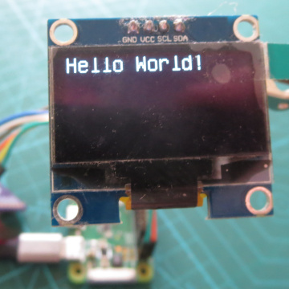
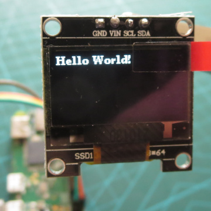
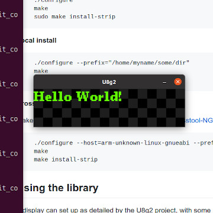

# Examples

Build the examples individually.

## ex_init_class
Initialise a display U8g2-style using C++:
[ex_init_class.cpp](ex_init_class.cpp)

Build with
```
make ex_init_class
```


## ex_init_c

Initialise a display U8g2-style using C:
[ex_init_c.c](ex_init_c.c)

Build with
```
make ex_init_c
```


## ex_init_runtime
Initialise a display specified by a string:
[ex_init_runtime.cpp](ex_init_runtime.cpp)

Build with
```
make ex_init_runtime
```


## ex_extra_fonts
Use a font with a GPL licence:
[ex_extra_fonts.cpp](ex_extra_fonts.cpp)

Build with
```
LDLIBS=-l:libu8g2fonts_gplcopyleft.a make ex_extra_fonts
```

  
## ex_init_command_line

Initialise a display specified on the command line,
with optional support for SDL:
[ex_init_command_linei.cpp](ex_init_command_line.cpp)

The SDL support enables a program to be developed on
other systems, for example Ubuntu running on an Intel processor, and display
into a window on the desktop rather than onto a hardware screen.

Build with
```
make ex_init_command_line
```

The following commands and images show the example program being run on
several displays.
  
```
./ex_init_command_line SSD1306,128X64,I2C
 ```


```
./ex_init_command_line SH1106,128X32,I2C
```


```
./ex_init_command_line SH1106,128X64,I2C
```


```
./ex_init_command_line SH1106,128X64,SPI,dc=24
```

  
To enable SDL support, install an SDL development package and build with
```
ENABLE_SDL=1 make ex_init_command_line
```
To display using SDL, run the program with
```
./ex_init_command_line SDL
```


Specify the screen resolution with, e.g.
```
./ex_init_command_line SDL,128X32
```


